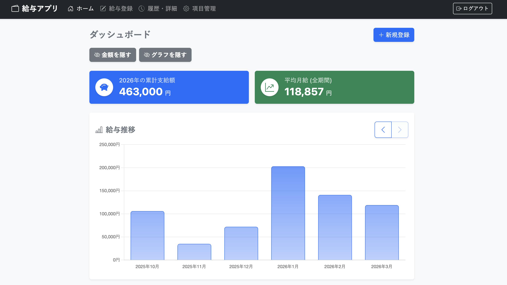
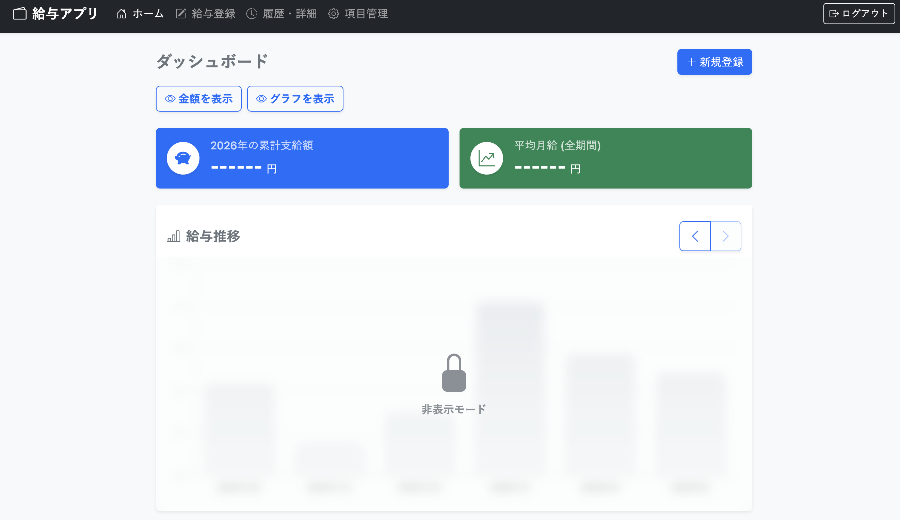
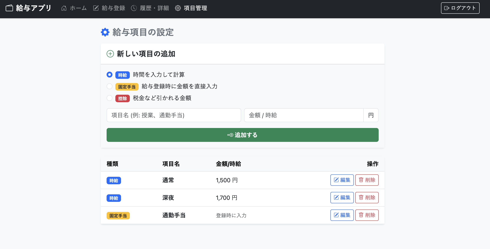

# 💰 給与管理・計算アプリ (Salary App)


時給制のアルバイトや手当、税金控除などを詳細に管理・計算するためのWebアプリケーションです。
スマートフォンからの入力を強く意識したレスポンシブなUIと、プライバシーに配慮した動的グラフ機能を備えています。

## ✨ 主な機能

### 📊 直感的なダッシュボード
* **給与推移グラフ**: Chart.jsを利用し、過去6ヶ月の推移をアニメーション付きでシームレスにスライド確認できます。
* **プライバシーモード**: 覗き見防止のため、ワンタップで金額を伏字（`------ 円`）にし、グラフに「すりガラス（ぼかし）効果」を適用できます。
* **自動集計**: 今年の累計支給額と、全期間の平均月給を自動で算出して表示します。

### 🧮 高度で柔軟な給与計算
* **複数タイプの項目管理**: 「時給」「固定手当」「控除（マイナス）」の3種類をユーザーが自由に作成・管理できます（論理削除対応）。
* **正確な端数処理**: 時給 × 時間の計算時、項目ごとに小数点が発生した場合は即座に「切り上げ」を行う実務的なルールを採用。
* **源泉徴収の自動化**: 「10.21%自動入力」ボタンにより、所得税などの計算をワンタップで完了できます。
* **フローティングUI**: 入力項目が多くなっても、画面下部に「最終支給額」と「登録ボタン」が常に追従するため、スマホでも快適に操作できます。

### 🔒 セキュアな認証・管理
* ユーザー登録とパスワードのハッシュ化（`password_hash`）による安全なログイン機能。
* 過去データの閲覧・編集・削除機能を備えた詳細な履歴ページ。

---

## 📷 スクリーンショット

| ダッシュボード (通常表示) | ダッシュボード (プライバシーモード) |
|:---:|:---:|
|  |  |
| **給与登録・計算画面** | **項目管理画面** |
|  |  |


---

## 🛠 技術スタック

* **Backend**: PHP (Vanilla)
* **Database**: PostgreSQL / MySQL (PDO接続)
* **Frontend**: HTML5, CSS3, JavaScript (Vanilla)
* **UI Framework**: Bootstrap 5, Bootstrap Icons
* **Data Visualization**: Chart.js v4.x

---

## 📦 セットアップ・導入手順

ご自身の環境でこのアプリを動かすための手順です。

### 1. リポジトリのクローン
```bash
git clone [https://github.com/あなたのユーザー名/salary_app.git](https://github.com/あなたのユーザー名/salary_app.git)
cd salary_app
```

### 2. 環境設定ファイル (`env.php`) の作成

データベースのパスワード等を設定します。セキュリティのため、このファイルはGitの管理対象外（`.gitignore`）となっています。

```bash
# テンプレートをコピーして作成
cp env.example.php env.php
```

作成した `env.php` をエディタで開き、ご自身のデータベース環境に合わせて `DB_HOST`, `DB_NAME`, `DB_USER`, `DB_PASS` を書き換えてください。

### 3\. データベースの構築

ご自身のデータベース（PostgreSQL等）に接続し、以下のSQLを実行して必要なテーブルを作成してください。

\<details\>
\<summary\>\<b\>実行するSQLコードを表示する (クリックで展開)\</b\>\</summary\>

```sql
-- ユーザーテーブル
CREATE TABLE users (
    id SERIAL PRIMARY KEY,
    username VARCHAR(50) UNIQUE NOT NULL,
    password_hash TEXT NOT NULL
);

-- 給与項目テーブル
CREATE TABLE salary_items (
    id SERIAL PRIMARY KEY,
    user_id INTEGER REFERENCES users(id),
    item_name VARCHAR(100) NOT NULL,
    default_hourly_rate INTEGER DEFAULT 0,
    item_type VARCHAR(20) DEFAULT 'hourly', -- 'hourly', 'fixed', 'deduction'
    is_deleted BOOLEAN DEFAULT FALSE
);

-- 月次給与親テーブル
CREATE TABLE monthly_salaries (
    id SERIAL PRIMARY KEY,
    user_id INTEGER REFERENCES users(id),
    target_year INTEGER NOT NULL,
    target_month INTEGER NOT NULL,
    total_amount INTEGER NOT NULL,
    UNIQUE(user_id, target_year, target_month)
);

-- 給与明細詳細テーブル
CREATE TABLE salary_details (
    id SERIAL PRIMARY KEY,
    monthly_salary_id INTEGER REFERENCES monthly_salaries(id),
    salary_item_id INTEGER REFERENCES salary_items(id),
    hours_worked NUMERIC(10, 2),
    calculated_amount INTEGER NOT NULL
);
```

\</details\>

### 4\. 起動

PHPのビルトインサーバーを使って簡単に動作確認ができます。

```bash
php -S localhost:8000
```

ブラウザで `http://localhost:8000` にアクセスし、新規登録からお試しください！

-----

## 🛡 セキュリティに関する注意

  * データベース接続情報を含む `env.php` は絶対にパブリックリポジトリにPushしないでください。
  * 本番環境（レンタルサーバー等）にデプロイする際は、`.htaccess` 等を利用して `env.php` への直接アクセスを遮断するか、公開ディレクトリ（`public_html`）より上の階層に配置してください。